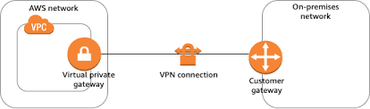

# terraform-aws-vpn-connection

This module creates the VPN site-to-site network resources.

The following resources will be created:
 - Private Gateway
 - Customer Gateway 
 - VPN Site-to-site connection


## Execution Diagram of `terraform-aws-vpn-connection`


## Usage

```hcl
module "vpn" {
  source = "git::https://github.com/DNXLabs/terraform-aws-vpn-connection?ref=1.0.0"
  vpc_id                                    = module.network[0].vpc_id
  vpn_gateway_amazon_side_asn               = 64512
  customer_gateway_bgp_asn                  = 65000
  customer_gateway_ip_address               = "172.0.0.1"
  route_table_ids                           = []
  vpn_connection_static_routes_only         = true
  vpn_connection_static_routes_destinations = ["10.80.1.0/24"]
  vpn_connection_tunnel1_inside_cidr        = null
  vpn_connection_tunnel2_inside_cidr        = null
  vpn_connection_tunnel1_preshared_key      = null
  vpn_connection_tunnel2_preshared_key      = null
}
```

<!--- BEGIN_TF_DOCS --->

## Requirements

| Name | Version |
|------|---------|
| terraform | >= 0.13.0 |
| aws | >= 3.56.0 |
| null | >= 2.0 |

## Providers

| Name | Version |
|------|---------|
| aws | >= 3.56.0 |

## Inputs

| Name | Description | Type | Default | Required |
|------|-------------|------|---------|:--------:|
| customer\_gateway\_bgp\_asn | The gateway's Border Gateway Protocol (BGP) Autonomous System Number (ASN) | `number` | `65000` | no |
| customer\_gateway\_ip\_address | The IP address of the gateway's Internet-routable external interface | `string` | n/a | yes |
| ipsec\_type | Define Ipsec Type | `string` | `"ipsec.1"` | no |
| name | ID element. Usually the component or solution name, e.g. 'app' or 'jenkins'.<br>This is the only ID element not also included as a `tag`.<br>The "name" tag is set to the full `id` string. There is no tag with the value of the `name` input. | `string` | n/a | yes |
| route\_table\_ids | The IDs of the route tables for which routes from the Virtual Private Gateway will be propagated | `list(string)` | `[]` | no |
| tags | Extra tags to attach to resources | `map(string)` | `{}` | no |
| transit\_gateway\_id | Define Transit gateway id in case private gateway is not defined | `string` | `null` | no |
| vpc\_id | The ID of the VPC to which the Virtual Private Gateway will be attached | `string` | n/a | yes |
| vpn\_connection\_local\_ipv4\_network\_cidr | The IPv4 CIDR on the customer gateway (on-premises) side of the VPN connection. | `string` | `"0.0.0.0/0"` | no |
| vpn\_connection\_remote\_ipv4\_network\_cidr | The IPv4 CIDR on the AWS side of the VPN connection. | `string` | `"0.0.0.0/0"` | no |
| vpn\_connection\_static\_routes\_destinations | List of CIDR blocks to be used as destination for static routes. Routes to destinations will be propagated to the route tables defined in `route_table_ids` | `list(string)` | `[]` | no |
| vpn\_connection\_static\_routes\_only | If set to `true`, the VPN connection will use static routes exclusively. Static routes must be used for devices that don't support BGP | `string` | `"true"` | no |
| vpn\_connection\_tunnel1\_dpd\_timeout\_action | The action to take after DPD timeout occurs for the first VPN tunnel. Specify restart to restart the IKE initiation. Specify clear to end the IKE session. Valid values are clear \| none \| restart. | `string` | `"clear"` | no |
| vpn\_connection\_tunnel1\_ike\_versions | The IKE versions that are permitted for the first VPN tunnel. Valid values are ikev1 \| ikev2. | `list(string)` | `[]` | no |
| vpn\_connection\_tunnel1\_inside\_cidr | The CIDR block of the inside IP addresses for the first VPN tunnel | `string` | `null` | no |
| vpn\_connection\_tunnel1\_phase1\_dh\_group\_numbers | List of one or more Diffie-Hellman group numbers that are permitted for the first VPN tunnel for phase 1 IKE negotiations. Valid values are 2 \| 5 \| 14 \| 15 \| 16 \| 17 \| 18 \| 19 \| 20 \| 21 \| 22 \| 23 \| 24. | `list(string)` | `[]` | no |
| vpn\_connection\_tunnel1\_phase1\_encryption\_algorithms | List of one or more encryption algorithms that are permitted for the first VPN tunnel for phase 1 IKE negotiations. Valid values are AES128 \| AES256 \| AES128-GCM-16 \| AES256-GCM-16. | `list(string)` | `[]` | no |
| vpn\_connection\_tunnel1\_phase1\_integrity\_algorithms | One or more integrity algorithms that are permitted for the first VPN tunnel for phase 1 IKE negotiations. Valid values are SHA1 \| SHA2-256 \| SHA2-384 \| SHA2-512. | `list(string)` | `[]` | no |
| vpn\_connection\_tunnel1\_phase2\_dh\_group\_numbers | List of one or more Diffie-Hellman group numbers that are permitted for the first VPN tunnel for phase 2 IKE negotiations. Valid values are 2 \| 5 \| 14 \| 15 \| 16 \| 17 \| 18 \| 19 \| 20 \| 21 \| 22 \| 23 \| 24. | `list(string)` | `[]` | no |
| vpn\_connection\_tunnel1\_phase2\_encryption\_algorithms | List of one or more encryption algorithms that are permitted for the first VPN tunnel for phase 2 IKE negotiations. Valid values are AES128 \| AES256 \| AES128-GCM-16 \| AES256-GCM-16. | `list(string)` | `[]` | no |
| vpn\_connection\_tunnel1\_phase2\_integrity\_algorithms | One or more integrity algorithms that are permitted for the first VPN tunnel for phase 2 IKE negotiations. Valid values are SHA1 \| SHA2-256 \| SHA2-384 \| SHA2-512. | `list(string)` | `[]` | no |
| vpn\_connection\_tunnel1\_preshared\_key | The preshared key of the first VPN tunnel. The preshared key must be between 8 and 64 characters in length and cannot start with zero. Allowed characters are alphanumeric characters, periods(.) and underscores(\_) | `string` | `null` | no |
| vpn\_connection\_tunnel1\_startup\_action | The action to take when the establishing the tunnel for the first VPN connection. By default, your customer gateway device must initiate the IKE negotiation and bring up the tunnel. Specify start for AWS to initiate the IKE negotiation. Valid values are add \| start. | `string` | `"add"` | no |
| vpn\_connection\_tunnel2\_dpd\_timeout\_action | The action to take after DPD timeout occurs for the second VPN tunnel. Specify restart to restart the IKE initiation. Specify clear to end the IKE session. Valid values are clear \| none \| restart. | `string` | `"clear"` | no |
| vpn\_connection\_tunnel2\_ike\_versions | The IKE versions that are permitted for the second VPN tunnel. Valid values are ikev1 \| ikev2. | `list(string)` | `[]` | no |
| vpn\_connection\_tunnel2\_inside\_cidr | The CIDR block of the inside IP addresses for the second VPN tunnel | `string` | `null` | no |
| vpn\_connection\_tunnel2\_phase1\_dh\_group\_numbers | List of one or more Diffie-Hellman group numbers that are permitted for the second VPN tunnel for phase 1 IKE negotiations. Valid values are 2 \| 5 \| 14 \| 15 \| 16 \| 17 \| 18 \| 19 \| 20 \| 21 \| 22 \| 23 \| 24. | `list(string)` | `[]` | no |
| vpn\_connection\_tunnel2\_phase1\_encryption\_algorithms | List of one or more encryption algorithms that are permitted for the second VPN tunnel for phase 1 IKE negotiations. Valid values are AES128 \| AES256 \| AES128-GCM-16 \| AES256-GCM-16. | `list(string)` | `[]` | no |
| vpn\_connection\_tunnel2\_phase1\_integrity\_algorithms | One or more integrity algorithms that are permitted for the second VPN tunnel for phase 1 IKE negotiations. Valid values are SHA1 \| SHA2-256 \| SHA2-384 \| SHA2-512. | `list(string)` | `[]` | no |
| vpn\_connection\_tunnel2\_phase2\_dh\_group\_numbers | List of one or more Diffie-Hellman group numbers that are permitted for the second VPN tunnel for phase 2 IKE negotiations. Valid values are 2 \| 5 \| 14 \| 15 \| 16 \| 17 \| 18 \| 19 \| 20 \| 21 \| 22 \| 23 \| 24. | `list(string)` | `[]` | no |
| vpn\_connection\_tunnel2\_phase2\_encryption\_algorithms | List of one or more encryption algorithms that are permitted for the second VPN tunnel for phase 2 IKE negotiations. Valid values are AES128 \| AES256 \| AES128-GCM-16 \| AES256-GCM-16. | `list(string)` | `[]` | no |
| vpn\_connection\_tunnel2\_phase2\_integrity\_algorithms | One or more integrity algorithms that are permitted for the second VPN tunnel for phase 2 IKE negotiations. Valid values are SHA1 \| SHA2-256 \| SHA2-384 \| SHA2-512. | `list(string)` | `[]` | no |
| vpn\_connection\_tunnel2\_preshared\_key | The preshared key of the second VPN tunnel. The preshared key must be between 8 and 64 characters in length and cannot start with zero. Allowed characters are alphanumeric characters, periods(.) and underscores(\_) | `string` | `null` | no |
| vpn\_connection\_tunnel2\_startup\_action | The action to take when the establishing the tunnel for the second VPN connection. By default, your customer gateway device must initiate the IKE negotiation and bring up the tunnel. Specify start for AWS to initiate the IKE negotiation. Valid values are add \| start. | `string` | `"add"` | no |
| vpn\_gateway\_amazon\_side\_asn | The Autonomous System Number (ASN) for the Amazon side of the VPN gateway. If you don't specify an ASN, the Virtual Private Gateway is created with the default ASN | `number` | `64512` | no |

## Outputs

| Name | Description |
|------|-------------|
| customer\_gateway\_id | Customer Gateway ID |
| vpn\_connection\_customer\_gateway\_configuration | The configuration information for the VPN connection's Customer Gateway (in the native XML format) |
| vpn\_connection\_id | VPN Connection ID |
| vpn\_connection\_tunnel1\_address | The public IP address of the first VPN tunnel |
| vpn\_connection\_tunnel1\_cgw\_inside\_address | The RFC 6890 link-local address of the first VPN tunnel (Customer Gateway side) |
| vpn\_connection\_tunnel1\_vgw\_inside\_address | The RFC 6890 link-local address of the first VPN tunnel (Virtual Private Gateway side) |
| vpn\_connection\_tunnel2\_address | The public IP address of the second VPN tunnel |
| vpn\_connection\_tunnel2\_cgw\_inside\_address | The RFC 6890 link-local address of the second VPN tunnel (Customer Gateway side) |
| vpn\_connection\_tunnel2\_vgw\_inside\_address | The RFC 6890 link-local address of the second VPN tunnel (Virtual Private Gateway side) |
| vpn\_gateway\_id | Virtual Private Gateway ID |

<!--- END_TF_DOCS --->

## Authors

Module managed by [DNX Solutions](https://github.com/DNXLabs).

## License

Apache 2 Licensed. See [LICENSE](https://github.com/DNXLabs/terraform-aws-vpn-connection/blob/master/LICENSE) for full details.
